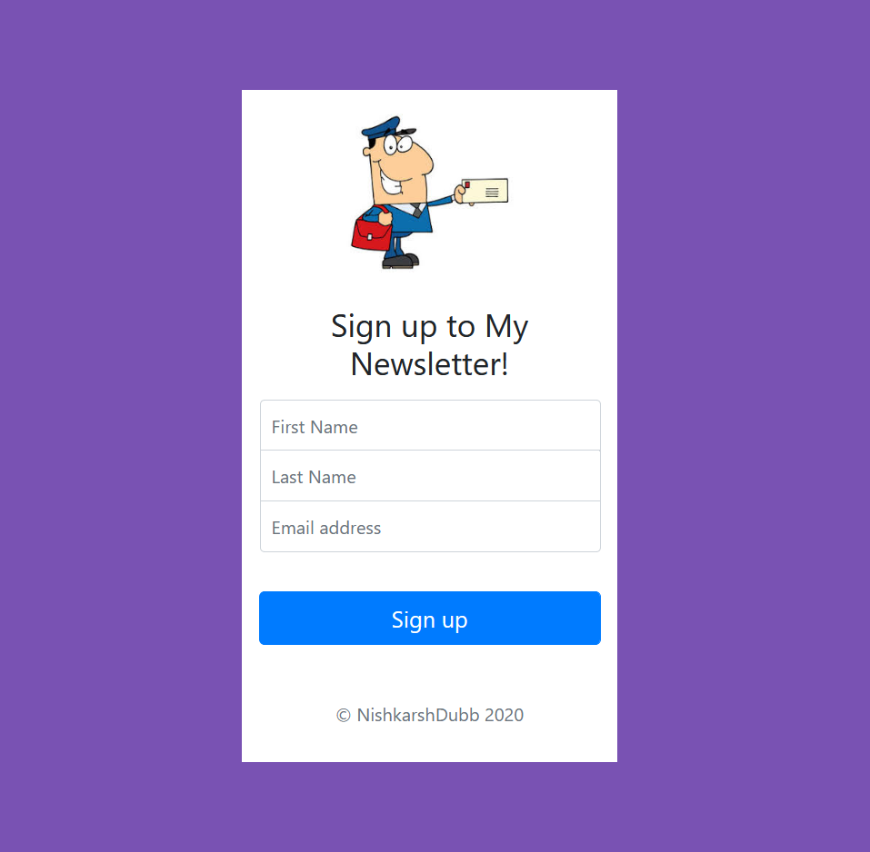

# Create a NewsLetter Web App  
This is a Newsetter Web App, I've integrated it with MailChimp API. Here I explored how to work with their API and how to POST data and communicate with their servers.

## Author 
> Nishkarsh Dubb

## Screenshots 📷

## Live Demo 

 [https://newletter-nishkarshdubb.herokuapp.com/](https://newletter-nishkarshdubb.herokuapp.com/)

## Developed Using 💻

+ [Html](https://developer.mozilla.org/en-US/docs/Web/HTML)
+ [Css](https://developer.mozilla.org/en-US/docs/Web/CSS)
+ [Bootstrap](https://getbootstrap.com/)
+ [Javascript](https://developer.mozilla.org/en-US/docs/Web/javascript)
+ [Nodejs](https://nodejs.org/en/)
+ [Express](http://expressjs.com/)

## Installation or Getting Started

Run the following command in the terminal:

	git clone https://github.com/Nishkarsh01/NewLetter-Project.git
or download the zip file from github.
    

## Usage
After extracting the files,

    cd NewLetter-Project
    npm install 
    node app.js

## Collaborate
To collaborate, reach me on [nishdubb11@gmail.com]()

## Further help/Reference

+ [MDN Web Docs](https://developer.mozilla.org/en-US/)
+ [getbootstrap.com](https://getbootstrap.com/)
+ [nodejs.org](https://nodejs.org/en/)
+ [expressjs.com](http://expressjs.com/)
+ [mongodb.com](https://www.mongodb.com/)
+ [mailchimp.com/developer](https://mailchimp.com/developer/)

    

